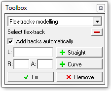
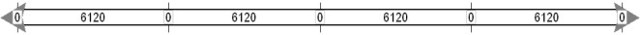
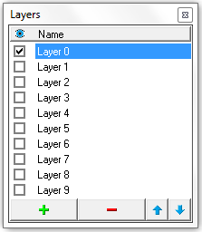
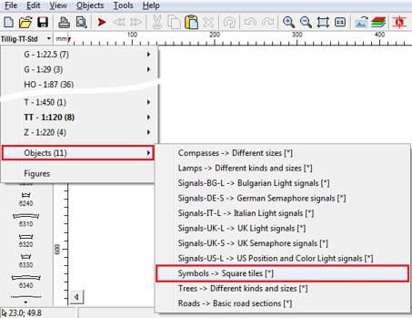
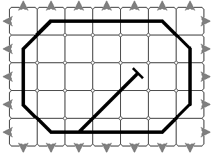
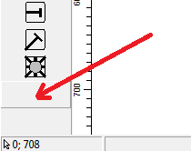
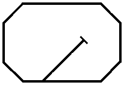

| 🔗 [SCARM Home Page](https://www.scarm.info/index.php) | 

## Working with Tracks

#### How to move the tracks?
Hold Ctrl and drag selected tracks with left mouse button or right-click over the selection and use "Move" command from the context menu.

#### How to disconnect and connect the tracks?
This is done automatically when tracks are moved.
- Disconnecting: select track or track section, hold Ctrl and drag it away with left mouse button.
- Connecting: select track or track section, hold Ctrl and drag it with left mouse button to another track, thus track ends overlap each other. When overlapping occurs, arrows at track ends will colour in red and green - release the mouse button and the tracks will be joined automatically.

#### How to rotate tracks?
If you want to place new track, rotated at given angle (or rotate existing track on the plot), place new [Start point at desired direction](https://www.scarm.info/index.php?page=help&topic=13) and then place the track (or move the existing track) in that point.
  An easier way of rotating already placed track on the plot is to select the track and then use "Edit" > "Rotate" menu command.
  If you want to turn the track, you can do this by disconnecting it and connecting again from the opposite side.
  You can also flip the track horizontally or vertically, by use of "Edit" > "Flip" menu command.

#### How to make snips from regular tracks?
If you need to make a custom length piece from regular straight or curve, select the desired track, right click over it on the place where you want to cut it and use “Snip off” command from the context menu. The track will be split on two custom pieces and each will be marked with a scissors symbol in the track label.
In this way, you can fill a gaps in the route, using sectional straight tracks in systems where flex tracks does not exists (i.e. in track systems with ballast roadbed preinstalled). Just place some longer piece on the one side and snip it off at the other side of the gap – the join will be automatically obtained. Remove the other unnecessary part of the snipped track by selecting and then deleting it.
Only plain straight and curved tracks can be snipped off. Special and functional tracks (i.e. rerailers, uncouplers, sensors, etc.) cannot be snipped.
Note Each cutting is counted as a whole single track in the Parts list.

#### How to set direction angle of the start point?
Hold the left mouse button while placing the start point, move the mouse in the desired direction and release the button when ready.
You can precisely set the position and the angle by use of "Start point" function in the [Toolbox](https://www.scarm.info/index.php?page=help&topic=32).

## How to work with flex-tracks?
Flex-tracks has maximum length and minimum radius of curve by default. You can modelling your flex route with many straight and curved sections within, but single flex-track cannot be longer than max length and cannot be curved more than min curve radius. If you want to build longer flexible route, use Spacebar to add new flex-track, after finishing with modelling of the last one.

#### Laying and shaping
Select the flex-track from left panel - a straight grey rail will appear on the plot with max possible length. Use mouse to form a curvature and length of the first section - it will be drawn in black and the remaining part will be drawn in grey. Click left mouse button to fix the section and to continue with remaining part. Click right mouse button to fix the section and to "cut" the remaining part. If you does not like the last fixed section, you can delete it using Backspace key. If you want to cancel the modelling, press Esc.
  For precise shaping with parameters like length or radius and angle of the flex-sections, see the "Flex-tracks modelling" function in the [Toolbox](https://www.scarm.info/index.php?page=help&topic=32).
  *Toolbox: Flex-tracks modelling*

Intended for precise shaping of flex-tracks by entering the parameters of each section. The modelling of the sections can be performed both with mouse and from the Toolbox. Start with selection and placement of the flex-track from the tracks selection panel. The flex-track will follow the cursor, while you are moving the mouse on the drawing plot – don’t worry about this. To add a straight section, enter desired length in L field and press "+ Straight" button. To add a curved section, enter desired radius in R field and curvature angle in A field, then press "+ Curve" button. If the radius you entered is smaller than minimal for the given flex-track, the section will be added with the minimal possible radius. Positive angle gives right curve, while negative is used for left curve from the current direction. If the last added section is not suitable, you can delete it by pressing of the small red [-] button. When flex-track shape is ready, press "Fix" button. If "Add tracks automatically" option is checked, the program will add the required number or flex pieces in order to accomplish the given length of radius/angle task when the remaining unshaped distance of the active flex track is not enough.

#### Manual connecting
If you want to connect the flex-track to other track in the layout, point the grey remaining part in the direction of that track endpoint, so both tracks to overlap each other - when directions became identical, the arrow of the flex-track will be colored in green - click left mouse button to connect the tracks.

#### Automatic joining
Another, easier way for connecting of the flex-track to the other part of the track plan is to move the end of the last flex-section (in black color) directly over the end point (grey arrow) of the track where you want to obtain a join. If possible, the flex-track will be auto shaped with largest possible radius and a black dot will appear over the green connecting arrow (the dot is not visible when Track Heights are shown). Click with left mouse button to make the connection.

#### Editing
If you want to edit and re-shape already placed flex-track, select it first, then right click over it near the end which you want to change and select “Reshape” from the context menu. That will place the selected flex-track in edit mode and you can shape it again as described above. If the track contains several sections, you can delete the last (currently edited) section, by pressing of Backspace key. If you want to cancel editing, press Esc.

#### Splitting
If you want to split already placed flex-track on two pieces, select it first, then right click over the place where you want to split and select “Split” from the context menu.

## How to set heights and slopes?
Setting of heights and slopes allows deploying of layout track route in more than one level. To start doing this, toggle "View" > "Show Track Heights" from the menu. The height markers will be drawn at track ends and their initial values will be zeroes in selected measurement unit.
  

To change the height (or the slope) of given track (or track section), first the track(s) must be selected and then you will be able to select desired height marker with left mouse button. You cannot directly select and change heights of tracks, which are not selected.
  

Use the mouse wheel or '<' and '>' keys or "Increase"  and "Decrease"  buttons in the Toolbar to set the selected height. Hold Shift for bigger changing step. Setting of height will form the slope of selected track or section automatically. Gradient will be shown in percents with colour, depending on length and angle: up to 2.5% - green; up to 4% - yellow; over 4% - red. Positive values are representing climb to selected height, while negative values are for descend.
  

- To review the gradients of all sloped sections in the track plan, press "L" key one or more times to toggle the track labels between Name, Number, Slope and off modes. Flat sections will be shown with zero gradient.
- To set the selected tracks to the same (flat) height level, you need to select some height marker in the selection (no matter which), to adjust its height (if needed) and to press Enter – all selected tracks will receive the same height.
- To raise or lower a selected section and to keep the already set gradients of the tracks, you need to select some height marker in the selection (no matter which) and while holding Alt key down, to change the height with the mouse wheel or "Increase" and "Decrease" height buttons.
- For vertical transposition of all tracks and objects together while keeping the preset heights and slopes in the plan, use the “Height shift” function in the [Toolbox](https://www.scarm.info/index.php?page=help&topic=32).
- If you want, you can also enter the height by use of the numeric keys. To do that, toggle the "Numeric Heights Input"  button in the Toolbar. Now, when you select some height marker, you will be able to type its height value directly, using the numeric keys. Use Backspace key to delete the last digit. You can use decimal separator (',' or '.' key, depending of your locale settings) to enter the height value with precision of 0.1mm or 0.01". Note that in Numeric Height Input mode you will be unable to use '<' and '>' keys to alter the track height, but you can still use the mouse scroll wheel or "Increase" and "Decrease" height buttons in the Toolbar instead.
- All type of tracks can have different heights, but only straights, curves and flex-tracks can form slopes, because only they can have independent heights on both ends. To set same heights for all tracks in the selected track section, select any height from it, set the desired height level and press Enter. Use 3D Viewer in order to see the different heights in the layout – the program will automatically place required supports under tracks with heights greater than zero.

!!! note "Note"
    The heights are set according to the level of the baseboard (table) and are measured to the base of the tracks.

!!! note "Note"
    Starting from version 0.8.4, the gradients are shown in percents by default. The setting is located in "Tools" > "Settings..." > "Dimensions" tab > "Gradients", where you can select between Percents (%) and Thousands (‰). The proportion "percents/thousands" is 1:10, so 1% = 10‰.

## How to work with layers?
The layers are intended to help you when designing complex layouts which contains many overlapping details such as tracks and objects on several levels. SCARM allows using unlimited number* of layers on which you can assign the different track levels or details, like scenery items, roadway network, signalling, wiring, etc.
  To show the layers control panel, select “View” > “Layers” from the main menu – the Layers window will appear in the bottom right corner of the screen.
  

The selected layer (marked in blue) is the currently active layer. All newly placed or pasted tracks and objects will be assigned to the active layer. To make another layer active, just select it by clicking over its name in the Layers window. To rename a layer, select it and then click again over its name to make it editable.
- To show or hide a given layer (and all associated tracks and objects in the track plan), just toggle the layer's check box. You cannot hide the currently active layer.
- To select all the tracks and objects in the plan that are assigned to a given layer, just double click over its name.
- To move the selection to another layer, use “Cut” command, select the desired layer to make it active and then use “Paste” command or just use “Transfer to Layer” command from the context menu.
- To add a new layer, click on the button \[+\] in the Layers window.
- To delete a layer, select it and click on the button \[-\] in the Layers window.
- To rearrange the layers in the list, use the small arrow buttons in order to move the active layer up or down.

<mark>The layers that contains tracks and/or objects are marked with a small grey dot between the check box and the name. The empty layers does not have such mark.<mark>

Click over the Layers panel header bar to make visible all layers that contains tracks and/or objects. Click once again to hide all layers except the active one.
By default, all layers are always visible in the 3D Viewer, regardless of the visibility settings in the Layers window. If you want to apply the layers visibility also in 3D viewing mode, go to “Tools” > “Settings” > “3D view” > “Layers” and enable “Apply visibility in 3D” option.
\* Only in the licensed version

## Control Panels
To start working with the symbols, you need to select “Symbols” library from the “Objects” sub-menu in track libraries list.
  

> 💡 **Tip:** While you can draw the symbol diagram together with the track plan in the same project, it is advisable to save the diagram in a separate blank project file as SCARM cannot show the terrain in 3D when there are symbols on the layout.

Example diagram, drawn by the symbols.
  

To hide the remaining outer arrows, select each arrow and click on the last button in the selection panel, below the symbol for turntable. As the symbol for hiding of the joining arrows is invisible, there is no icon on the button (it is blank), but it is there, just below the last symbol in the list.
  

> 💡 **Tip:** For fast hiding of all remaining outer arrows, just hit space bar after first use of the blank button.

To hide also the tile contours (borders of the symbols), toggle Track separators check box in “Tools” > “Settings” > “2D View” page > “Tracks” group or <mark>just press “S” key</mark>.
  
   Now your diagram is ready for printing or export to BMP or JPG file formats. You can also add texts and labels to the diagrams using the text entering feature of SCARM as well as figures and objects from other libraries in order to represent control panel’s keys and indicators placeholders, layout signals and other similar items.